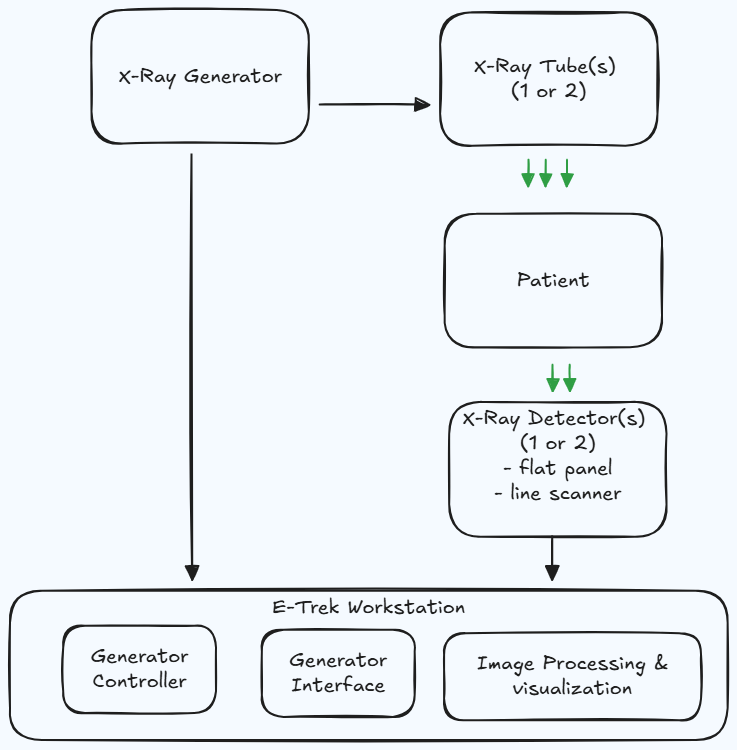

# E-TREK Software Architecture Document

## Document Information

| Item | Description |
|------|-------------|
| Project | E-TREK Digital Radiography Workstation |
| Version | 1.0 |
| Last Updated | January 2025 |
| Architecture Model | 4+1 Architectural View Model |

---

## 1. Introduction

### 1.1 Purpose

This document describes the software architecture of E-TREK, a medical imaging Digital Radiography (DR) workstation application. The architecture is presented using the 4+1 View Model, which addresses the concerns of different stakeholders through five complementary views: Logical, Development, Process, Physical, and Scenarios.

### 1.2 Scope

E-TREK is designed as a generic workstation software for medical X-ray imaging systems. The software integrates with hospital information systems through DICOM Modality Worklist (MWL), controls X-ray hardware including generators and detectors, and provides comprehensive image viewing capabilities.

**The system supports multiple simultaneous Modality Worklist connections**, allowing integration with different RIS (Radiology Information System) providers. Each MWL connection can be independently configured with its own DICOM tag mappings, transfer syntaxes, and query parameters. This flexibility enables healthcare facilities to connect to multiple scheduling systems or migrate between providers without software modifications.

### 1.3 Definitions and Acronyms

| Term | Definition |
|------|------------|
| DR | Digital Radiography |
| DICOM | Digital Imaging and Communications in Medicine |
| MWL | Modality Worklist |
| RIS | Radiology Information System |
| PACS | Picture Archiving and Communication System |
| AEC | Automatic Exposure Control |
| SID | Source-to-Image Distance |
| kVp | Kilovoltage Peak |
| mA | Milliampere |

---

## 2. X-Ray Machine Context

### 2.1 Target Hardware

E-TREK is designed as a workstation software for medical X-ray machines. The software is intentionally generic and independent of any specific X-ray equipment manufacturer, allowing device manufacturers and system integrators to incorporate E-TREK into their products.

<!--
```
┌─────────────────────────────────────────────────────────────────────┐
│                      X-RAY IMAGING SYSTEM                           │
├─────────────────────────────────────────────────────────────────────┤
│                                                                     │
│   ┌─────────────┐     ┌─────────────┐     ┌─────────────────────┐  │
│   │  X-Ray      │     │  X-Ray      │     │                     │  │
│   │  Generator  │────▶│  Tube(s)    │────▶│  Patient            │  │
│   │             │     │  (1 or 2)   │     │                     │  │
│   └─────────────┘     └─────────────┘     └─────────────────────┘  │
│         │                                           │               │
│         │                                           ▼               │
│         │                                 ┌─────────────────────┐  │
│         │                                 │  Detector(s)        │  │
│         │                                 │  (1 or 2)           │  │
│         │                                 │  - Flat Panel       │  │
│         │                                 │  - Line Scanner     │  │
│         │                                 └─────────────────────┘  │
│         │                                           │               │
│         ▼                                           ▼               │
│   ┌─────────────────────────────────────────────────────────────┐  │
│   │                    E-TREK WORKSTATION                        │  │
│   │  ┌─────────────┐  ┌─────────────┐  ┌─────────────────────┐  │  │
│   │  │ Generator   │  │ Detector    │  │ Image Processing    │  │  │
│   │  │ Control     │  │ Interface   │  │ & Visualization     │  │  │
│   │  └─────────────┘  └─────────────┘  └─────────────────────┘  │  │
│   └─────────────────────────────────────────────────────────────┘  │
│                                                                     │
└─────────────────────────────────────────────────────────────────────┘
```
-->



### 2.2 Supported Configurations

The device organization in E-TREK supports various X-ray system configurations:

**Detector Configurations:**
- Single detector systems (standard radiography)
- Dual detector systems (table + wall stand, or dual wall stands)
- Line scanner detectors (for slot radiography and cephalometry)

**X-Ray Tube Configurations:**
- Single tube systems
- Dual tube systems (ceiling-mounted + floor-mounted)

**Imaging Techniques:**
- Standard single-exposure radiography
- Dual-exposure techniques (for dual-energy subtraction imaging)
- Cephalography (orthodontic and ENT imaging)
- Slot scanning / Line scanning (full-leg, full-spine imaging)

### 2.3 Integration Model

E-TREK provides a hardware abstraction layer that allows equipment manufacturers to integrate their specific hardware through well-defined interfaces. The software communicates with hardware through configurable protocols including RS-232, RS-485, CAN bus, Modbus, and Ethernet.

```
┌──────────────────────────────────────────────────────────────────┐
│                    INTEGRATION ARCHITECTURE                       │
├──────────────────────────────────────────────────────────────────┤
│                                                                  │
│  ┌────────────────────────────────────────────────────────────┐  │
│  │                    E-TREK APPLICATION                       │  │
│  │  ┌──────────────────────────────────────────────────────┐  │  │
│  │  │              Hardware Abstraction Layer               │  │  │
│  │  └──────────────────────────────────────────────────────┘  │  │
│  └────────────────────────────────────────────────────────────┘  │
│                              │                                    │
│          ┌───────────────────┼───────────────────┐               │
│          ▼                   ▼                   ▼               │
│  ┌──────────────┐   ┌──────────────┐   ┌──────────────┐         │
│  │  Generator   │   │  Detector    │   │  Positioner  │         │
│  │  Driver      │   │  Driver      │   │  Driver      │         │
│  └──────────────┘   └──────────────┘   └──────────────┘         │
│          │                   │                   │               │
│          ▼                   ▼                   ▼               │
│  ┌──────────────┐   ┌──────────────┐   ┌──────────────┐         │
│  │ Manufacturer │   │ Manufacturer │   │ Manufacturer │         │
│  │ A Generator  │   │ B Detector   │   │ C Positioner │         │
│  └──────────────┘   └──────────────┘   └──────────────┘         │
│                                                                  │
└──────────────────────────────────────────────────────────────────┘
```

---

## 3. Architectural Concepts

Before describing the architecture views, this section introduces the key design patterns and principles used throughout E-TREK.

### 3.1 Model-View-Delegate Pattern

E-TREK uses the Model-View-Delegate (MVD) pattern, a variation of Model-View-Controller adapted for Qt applications. This pattern separates the application into three interconnected components:

```
┌─────────────────────────────────────────────────────────────────────┐
│                    MODEL-VIEW-DELEGATE PATTERN                       │
├─────────────────────────────────────────────────────────────────────┤
│                                                                     │
│                         ┌─────────────┐                             │
│                         │             │                             │
│              ┌─────────▶│   MODEL     │◀─────────┐                  │
│              │          │ (Data +     │          │                  │
│              │          │  Business   │          │                  │
│              │          │  Rules)     │          │                  │
│              │          │             │          │                  │
│              │          └─────────────┘          │                  │
│              │                                   │                  │
│         Reads Data                          Updates Data            │
│              │                                   │                  │
│              │                                   │                  │
│     ┌────────┴────────┐               ┌─────────┴────────┐         │
│     │                 │    User       │                  │         │
│     │      VIEW       │───Actions────▶│    DELEGATE      │         │
│     │  (UI Widgets)   │               │ (Business Logic) │         │
│     │                 │◀──UI Updates──│                  │         │
│     └─────────────────┘               └──────────────────┘         │
│                                                                     │
│  VIEW: Handles display and user interaction (Qt Widgets)            │
│  DELEGATE: Implements business logic and coordinates operations     │
│  MODEL: Represents data and domain entities                         │
│                                                                     │
└─────────────────────────────────────────────────────────────────────┘
```

**Benefits of MVD:**
- Clear separation between UI and business logic
- Views can be replaced or modified without changing business rules
- Business logic can be tested independently of the UI
- Multiple views can share the same delegate logic

### 3.2 Builder Pattern

E-TREK uses the Builder pattern to construct complex objects (pages with their delegates and dependencies). Builders encapsulate the construction logic, making it easier to create properly configured objects.

```
┌─────────────────────────────────────────────────────────────────────┐
│                        BUILDER PATTERN                               │
├─────────────────────────────────────────────────────────────────────┤
│                                                                     │
│   ┌─────────────────┐                                               │
│   │  DelegateParams │──────┐                                        │
│   │  - dbConnection │      │                                        │
│   │  - contextMgr   │      │                                        │
│   └─────────────────┘      │                                        │
│                            ▼                                        │
│                    ┌───────────────┐                                │
│                    │               │                                │
│                    │    BUILDER    │                                │
│                    │               │                                │
│                    └───────┬───────┘                                │
│                            │                                        │
│            ┌───────────────┼───────────────┐                        │
│            │               │               │                        │
│            ▼               ▼               ▼                        │
│   ┌─────────────┐  ┌─────────────┐  ┌─────────────┐                │
│   │ Repository  │  │    View     │  │  Delegate   │                │
│   │ Instances   │  │   Widget    │  │  Instance   │                │
│   └─────────────┘  └─────────────┘  └─────────────┘                │
│            │               │               │                        │
│            └───────────────┴───────────────┘                        │
│                            │                                        │
│                            ▼                                        │
│                  ┌───────────────────┐                              │
│                  │ Fully Configured  │                              │
│                  │ Page + Delegate   │                              │
│                  └───────────────────┘                              │
│                                                                     │
└─────────────────────────────────────────────────────────────────────┘
```

### 3.3 Dependency Injection

Dependency Injection (DI) is a technique where objects receive their dependencies from external sources rather than creating them internally. In E-TREK, the `DelegateParameter` structure serves as a simple dependency injection container.

```
┌─────────────────────────────────────────────────────────────────────┐
│                    DEPENDENCY INJECTION                              │
├─────────────────────────────────────────────────────────────────────┤
│                                                                     │
│   WITHOUT DI (Tight Coupling):                                      │
│   ┌─────────────────────────────────────────────────────────┐      │
│   │  class WorklistPage {                                    │      │
│   │      WorklistPage() {                                    │      │
│   │          repo = new WorklistRepository("localhost",...); │ ✗    │
│   │      }  // Hard-coded dependency                         │      │
│   │  }                                                       │      │
│   └─────────────────────────────────────────────────────────┘      │
│                                                                     │
│   WITH DI (Loose Coupling):                                         │
│   ┌─────────────────────────────────────────────────────────┐      │
│   │  class WorklistPage {                                    │      │
│   │      WorklistPage(IWorklistRepository* repo) {           │ ✓    │
│   │          this->repo = repo;                              │      │
│   │      }  // Dependency injected from outside              │      │
│   │  }                                                       │      │
│   └─────────────────────────────────────────────────────────┘      │
│                                                                     │
│   DelegateParameter as DI Container:                                │
│   ┌─────────────────────────────────────────────────────────┐      │
│   │                                                          │      │
│   │   ApplicationService                                     │      │
│   │         │                                                │      │
│   │         │ creates                                        │      │
│   │         ▼                                                │      │
│   │   DelegateParameter ─────┬─────────┬─────────┐          │      │
│   │   {                      │         │         │          │      │
│   │     dbConnection ────────┤         │         │          │      │
│   │     contextManager ──────┼─────────┤         │          │      │
│   │   }                      │         │         │          │      │
│   │                          ▼         ▼         ▼          │      │
│   │                       Builder1  Builder2  Builder3      │      │
│   │                                                          │      │
│   └─────────────────────────────────────────────────────────┘      │
│                                                                     │
│   Benefits:                                                         │
│   • Components don't need to know how dependencies are created     │
│   • Easy to substitute mock objects for testing                    │
│   • Configuration centralized in one place                         │
│                                                                     │
└─────────────────────────────────────────────────────────────────────┘
```

### 3.4 Repository Pattern

The Repository pattern abstracts data access behind a collection-like interface. Components work with repositories rather than directly with the database, making the code more testable and the data layer replaceable.

```
┌─────────────────────────────────────────────────────────────────────┐
│                      REPOSITORY PATTERN                              │
├─────────────────────────────────────────────────────────────────────┤
│                                                                     │
│   ┌─────────────────┐                                               │
│   │    Delegate     │                                               │
│   │  (Business      │                                               │
│   │   Logic)        │                                               │
│   └────────┬────────┘                                               │
│            │                                                        │
│            │ Uses interface                                         │
│            ▼                                                        │
│   ┌─────────────────┐                                               │
│   │  IRepository    │  ◀─── Abstract interface                      │
│   │  + getAll()     │                                               │
│   │  + getById()    │                                               │
│   │  + save()       │                                               │
│   │  + delete()     │                                               │
│   └────────┬────────┘                                               │
│            │                                                        │
│            │ Implemented by                                         │
│            ▼                                                        │
│   ┌─────────────────┐                                               │
│   │   Repository    │  ◀─── Concrete implementation                 │
│   │  (SQL queries,  │                                               │
│   │   transactions) │                                               │
│   └────────┬────────┘                                               │
│            │                                                        │
│            ▼                                                        │
│   ┌─────────────────┐                                               │
│   │    Database     │                                               │
│   │    (MySQL)      │                                               │
│   └─────────────────┘                                               │
│                                                                     │
└─────────────────────────────────────────────────────────────────────┘
```

---

## 4. Scenarios (Use Cases)

The Scenarios view describes the key use cases that drive the architecture. These scenarios illustrate how the architectural elements work together to deliver functionality.

### 4.1 Primary Use Cases

```
┌─────────────────────────────────────────────────────────────────────┐
│                       PRIMARY USE CASES                              │
├─────────────────────────────────────────────────────────────────────┤
│                                                                     │
│                        ┌─────────────┐                              │
│                        │  Operator   │                              │
│                        │ (Technician)│                              │
│                        └──────┬──────┘                              │
│                               │                                     │
│       ┌───────────────────────┼───────────────────────┐            │
│       │                       │                       │            │
│       ▼                       ▼                       ▼            │
│  ┌─────────┐           ┌─────────────┐         ┌──────────┐        │
│  │ UC-01   │           │   UC-02     │         │  UC-03   │        │
│  │ Login   │           │ Select      │         │ Capture  │        │
│  │         │           │ Patient     │         │ Image    │        │
│  └─────────┘           └─────────────┘         └──────────┘        │
│                                                                     │
│       ┌───────────────────────┼───────────────────────┐            │
│       │                       │                       │            │
│       ▼                       ▼                       ▼            │
│  ┌─────────┐           ┌─────────────┐         ┌──────────┐        │
│  │ UC-04   │           │   UC-05     │         │  UC-06   │        │
│  │ Review  │           │ Export to   │         │ Configure│        │
│  │ Image   │           │ PACS        │         │ System   │        │
│  └─────────┘           └─────────────┘         └──────────┘        │
│                                                                     │
└─────────────────────────────────────────────────────────────────────┘
```

### 4.2 UC-02: Select Patient from Worklist (Detailed)

This scenario illustrates the complete flow from selecting a patient to starting an examination.

```
┌─────────────────────────────────────────────────────────────────────┐
│              UC-02: SELECT PATIENT FROM WORKLIST                     │
├─────────────────────────────────────────────────────────────────────┤
│                                                                     │
│  Actor: Radiography Technician                                      │
│  Precondition: User is logged in, WorklistPage is displayed         │
│  Goal: Select a scheduled patient and start examination             │
│                                                                     │
│  FLOW:                                                              │
│  ┌──────────────────────────────────────────────────────────────┐  │
│  │ 1. System queries MWL from configured RIS connections        │  │
│  │    ┌─────────┐     ┌─────────┐     ┌─────────┐              │  │
│  │    │  RIS 1  │     │  RIS 2  │     │  Local  │              │  │
│  │    └────┬────┘     └────┬────┘     └────┬────┘              │  │
│  │         │               │               │                    │  │
│  │         └───────────────┼───────────────┘                    │  │
│  │                         ▼                                    │  │
│  │                 ┌───────────────┐                            │  │
│  │                 │ Merged        │                            │  │
│  │                 │ Worklist      │                            │  │
│  │                 └───────────────┘                            │  │
│  └──────────────────────────────────────────────────────────────┘  │
│                                                                     │
│  ┌──────────────────────────────────────────────────────────────┐  │
│  │ 2. Technician selects patient from worklist table            │  │
│  │                                                               │  │
│  │    ┌─────────────────────────────────────────────────────┐   │  │
│  │    │ Patient Name  │ Procedure      │ Status   │ Source  │   │  │
│  │    ├───────────────┼────────────────┼──────────┼─────────┤   │  │
│  │    │ John Smith    │ Chest PA/LAT   │ SCHEDULED│ RIS 1   │   │  │
│  │    │ ▶ Jane Doe    │ Knee AP/LAT    │ SCHEDULED│ RIS 2   │ ◀─┼───Selected
│  │    │ Bob Johnson   │ Hand AP        │ SCHEDULED│ Local   │   │  │
│  │    └─────────────────────────────────────────────────────┘   │  │
│  └──────────────────────────────────────────────────────────────┘  │
│                                                                     │
│  ┌──────────────────────────────────────────────────────────────┐  │
│  │ 3. System loads procedure details and technique defaults     │  │
│  │                                                               │  │
│  │    Procedure: Knee AP/LAT                                    │  │
│  │         │                                                    │  │
│  │         ├──▶ View 1: Knee AP                                 │  │
│  │         │      └─▶ Technique: 60kVp, 5mAs, Grid             │  │
│  │         │                                                    │  │
│  │         └──▶ View 2: Knee LAT                                │  │
│  │                └─▶ Technique: 65kVp, 6mAs, Grid             │  │
│  └──────────────────────────────────────────────────────────────┘  │
│                                                                     │
│  ┌──────────────────────────────────────────────────────────────┐  │
│  │ 4. Technician clicks "Start Examination"                     │  │
│  │    → System navigates to ExamPage                            │  │
│  │    → Worklist status updated to IN_PROGRESS                  │  │
│  └──────────────────────────────────────────────────────────────┘  │
│                                                                     │
│  Postcondition: ExamPage displayed with patient data and           │
│                 technique defaults loaded                          │
│                                                                     │
└─────────────────────────────────────────────────────────────────────┘
```

### 4.3 Image Accept/Reject Workflow

After capturing an image, the technician must review and decide whether to accept or reject it. This decision affects the examination workflow and data management.

```
┌─────────────────────────────────────────────────────────────────────┐
│                  IMAGE ACCEPT/REJECT WORKFLOW                        │
├─────────────────────────────────────────────────────────────────────┤
│                                                                     │
│                    ┌─────────────────┐                              │
│                    │  Image Captured │                              │
│                    └────────┬────────┘                              │
│                             │                                       │
│                             ▼                                       │
│                    ┌─────────────────┐                              │
│                    │ Technician      │                              │
│                    │ Reviews Image   │                              │
│                    │ - Window/Level  │                              │
│                    │ - Zoom/Pan      │                              │
│                    │ - Measurements  │                              │
│                    └────────┬────────┘                              │
│                             │                                       │
│              ┌──────────────┴──────────────┐                       │
│              │                             │                       │
│              ▼                             ▼                       │
│     ┌─────────────────┐          ┌─────────────────┐              │
│     │    ACCEPT       │          │    REJECT       │              │
│     └────────┬────────┘          └────────┬────────┘              │
│              │                            │                        │
│              ▼                            ▼                        │
│  ┌────────────────────┐       ┌────────────────────┐              │
│  │ • Mark as ACCEPTED │       │ • Mark as REJECTED │              │
│  │ • Add to study     │       │ • Record reason:   │              │
│  │ • Queue for PACS   │       │   - Motion blur    │              │
│  │ • Update thumbnail │       │   - Poor exposure  │              │
│  │                    │       │   - Wrong position │              │
│  │                    │       │   - Patient moved  │              │
│  │                    │       │   - Equipment error│              │
│  └────────────────────┘       └────────────────────┘              │
│              │                            │                        │
│              │                            ▼                        │
│              │                 ┌────────────────────┐              │
│              │                 │ Prompt: Retake?    │              │
│              │                 └─────────┬──────────┘              │
│              │                           │                         │
│              │              ┌────────────┴────────────┐            │
│              │              │                         │            │
│              │              ▼                         ▼            │
│              │     ┌──────────────┐         ┌──────────────┐      │
│              │     │  Yes: Retake │         │  No: Continue│      │
│              │     │  same view   │         │  to next view│      │
│              │     └──────────────┘         └──────────────┘      │
│              │                                        │            │
│              └────────────────────────────────────────┘            │
│                               │                                    │
│                               ▼                                    │
│                    ┌─────────────────┐                             │
│                    │ All views done? │                             │
│                    └────────┬────────┘                             │
│                             │                                      │
│              ┌──────────────┴──────────────┐                      │
│              │                             │                      │
│              ▼                             ▼                      │
│     ┌─────────────────┐          ┌─────────────────┐             │
│     │ No: Next View   │          │ Yes: Complete   │             │
│     │                 │          │ Examination     │             │
│     └─────────────────┘          └─────────────────┘             │
│                                                                    │
│  REJECT REASONS (Stored in Database):                             │
│  ┌────────────────────────────────────────────────────────────┐   │
│  │ Code │ Reason              │ Requires Retake │ Dose Added  │   │
│  ├──────┼─────────────────────┼─────────────────┼─────────────┤   │
│  │ R01  │ Motion artifact     │ Recommended     │ Yes         │   │
│  │ R02  │ Underexposure       │ Required        │ Yes         │   │
│  │ R03  │ Overexposure        │ Required        │ Yes         │   │
│  │ R04  │ Positioning error   │ Required        │ Yes         │   │
│  │ R05  │ Patient not ready   │ Required        │ Yes         │   │
│  │ R06  │ Equipment malfunction│ Required       │ Varies      │   │
│  │ R07  │ Test/Calibration    │ No              │ No (usually)│   │
│  └────────────────────────────────────────────────────────────┘   │
│                                                                    │
└─────────────────────────────────────────────────────────────────────┘
```

### 4.4 UC-03: Capture Image (Detailed)

```
┌─────────────────────────────────────────────────────────────────────┐
│                    UC-03: CAPTURE IMAGE                              │
├─────────────────────────────────────────────────────────────────────┤
│                                                                     │
│  Actor: Radiography Technician                                      │
│  Precondition: ExamPage displayed, patient positioned               │
│                                                                     │
│  FLOW:                                                              │
│                                                                     │
│  ┌──────────────────────────────────────────────────────────────┐  │
│  │ 1. Technician adjusts technique if needed                    │  │
│  │                                                               │  │
│  │    Default: 60 kVp, 5 mAs    ──▶    Adjusted: 65 kVp, 6 mAs │  │
│  │    (System suggests based on body part + patient size)       │  │
│  └──────────────────────────────────────────────────────────────┘  │
│                                                                     │
│  ┌──────────────────────────────────────────────────────────────┐  │
│  │ 2. Technician presses exposure button                        │  │
│  │                                                               │  │
│  │    ┌───────────┐  Command   ┌───────────┐                   │  │
│  │    │ E-TREK    │ ─────────▶ │ Generator │ ──▶ X-Ray Pulse   │  │
│  │    └───────────┘            └───────────┘                   │  │
│  └──────────────────────────────────────────────────────────────┘  │
│                                                                     │
│  ┌──────────────────────────────────────────────────────────────┐  │
│  │ 3. Detector captures and transfers image                     │  │
│  │                                                               │  │
│  │    ┌───────────┐  Raw Data  ┌───────────┐  Processed        │  │
│  │    │ Detector  │ ─────────▶ │ E-TREK    │ ─────────▶ Display│  │
│  │    └───────────┘            │ Processing│                   │  │
│  │                             └───────────┘                   │  │
│  │                                  │                           │  │
│  │                                  ▼                           │  │
│  │                          ┌─────────────┐                    │  │
│  │                          │ - Offset    │                    │  │
│  │                          │ - Gain      │                    │  │
│  │                          │ - Defect    │                    │  │
│  │                          │   Correction│                    │  │
│  │                          └─────────────┘                    │  │
│  └──────────────────────────────────────────────────────────────┘  │
│                                                                     │
│  ┌──────────────────────────────────────────────────────────────┐  │
│  │ 4. Technician reviews image                                  │  │
│  │    - Adjust window/level                                     │  │
│  │    - Add measurements (ruler, angle)                         │  │
│  │    - Accept or reject image                                  │  │
│  └──────────────────────────────────────────────────────────────┘  │
│                                                                     │
│  ┌──────────────────────────────────────────────────────────────┐  │
│  │ 5. System stores image metadata in DICOM tables              │  │
│  │                                                               │  │
│  │    studies ◀── series ◀── images ◀── acquisitions           │  │
│  └──────────────────────────────────────────────────────────────┘  │
│                                                                     │
└─────────────────────────────────────────────────────────────────────┘
```

### 4.5 Calibration and Service Mode

Users with Administrator or Engineer privileges can access special calibration and service functions. These operations are essential for maintaining detector quality and system performance.

```
┌─────────────────────────────────────────────────────────────────────┐
│                 CALIBRATION AND SERVICE MODE                         │
├─────────────────────────────────────────────────────────────────────┤
│                                                                     │
│  ACCESS CONTROL:                                                    │
│  ┌────────────────────────────────────────────────────────────────┐│
│  │  Role          │ Calibration │ Service Test │ Device Config   ││
│  ├────────────────┼─────────────┼──────────────┼─────────────────┤│
│  │  Technician    │     ✗       │      ✗       │       ✗         ││
│  │  Engineer      │     ✓       │      ✓       │       ✓         ││
│  │  Admin         │     ✓       │      ✓       │       ✓         ││
│  └────────────────────────────────────────────────────────────────┘│
│                                                                     │
│  CALIBRATION TYPES:                                                 │
│                                                                     │
│  ┌─────────────────────────────────────────────────────────────┐   │
│  │                    DETECTOR CALIBRATION                      │   │
│  │                                                              │   │
│  │  1. DARK IMAGE (Offset Calibration)                         │   │
│  │     ┌────────────────────────────────────────────────────┐  │   │
│  │     │ • No X-ray exposure                                │  │   │
│  │     │ • Captures detector baseline noise                 │  │   │
│  │     │ • Used to subtract electronic offset               │  │   │
│  │     │ • Typically: 10-50 frames averaged                 │  │   │
│  │     └────────────────────────────────────────────────────┘  │   │
│  │                          │                                   │   │
│  │                          ▼                                   │   │
│  │  2. BRIGHT IMAGE (Gain Calibration)                         │   │
│  │     ┌────────────────────────────────────────────────────┐  │   │
│  │     │ • Uniform X-ray exposure (no object)               │  │   │
│  │     │ • Captures detector sensitivity variations         │  │   │
│  │     │ • Used to normalize pixel response                 │  │   │
│  │     │ • Typically: 70-80 kVp, medium mAs                 │  │   │
│  │     └────────────────────────────────────────────────────┘  │   │
│  │                          │                                   │   │
│  │                          ▼                                   │   │
│  │  3. DEFECT MAP                                              │   │
│  │     ┌────────────────────────────────────────────────────┐  │   │
│  │     │ • Identifies dead/hot pixels                       │  │   │
│  │     │ • Creates interpolation map                        │  │   │
│  │     │ • Updated periodically or after detector service   │  │   │
│  │     └────────────────────────────────────────────────────┘  │   │
│  │                                                              │   │
│  └─────────────────────────────────────────────────────────────┘   │
│                                                                     │
│  SERVICE TEST IMAGING:                                              │
│                                                                     │
│  ┌─────────────────────────────────────────────────────────────┐   │
│  │                    TEST IMAGE CAPTURE                        │   │
│  │                                                              │   │
│  │  Purpose: Verify system performance without patient data    │   │
│  │                                                              │   │
│  │  ┌──────────────────┐  ┌──────────────────┐                 │   │
│  │  │ Resolution Test  │  │ Uniformity Test  │                 │   │
│  │  │ • Line pair      │  │ • Flat field     │                 │   │
│  │  │   phantom        │  │   exposure       │                 │   │
│  │  │ • MTF analysis   │  │ • SNR analysis   │                 │   │
│  │  └──────────────────┘  └──────────────────┘                 │   │
│  │                                                              │   │
│  │  ┌──────────────────┐  ┌──────────────────┐                 │   │
│  │  │ AEC Verification │  │ Dose Check       │                 │   │
│  │  │ • Ionization     │  │ • DAP meter      │                 │   │
│  │  │   chamber test   │  │   calibration    │                 │   │
│  │  │ • Density check  │  │ • mAs accuracy   │                 │   │
│  │  └──────────────────┘  └──────────────────┘                 │   │
│  │                                                              │   │
│  │  Test images are:                                            │   │
│  │  • NOT sent to PACS                                         │   │
│  │  • Stored in separate calibration folder                    │   │
│  │  • Tagged with "SERVICE" or "CALIBRATION" in metadata       │   │
│  │  • Can be reviewed and exported for QA reports              │   │
│  │                                                              │   │
│  └─────────────────────────────────────────────────────────────┘   │
│                                                                     │
│  CALIBRATION WORKFLOW:                                              │
│                                                                     │
│  ┌─────────┐    ┌─────────┐    ┌─────────┐    ┌─────────┐         │
│  │ Select  │───▶│ Prepare │───▶│ Capture │───▶│ Verify  │         │
│  │ Type    │    │ System  │    │ Images  │    │ Results │         │
│  └─────────┘    └─────────┘    └─────────┘    └────┬────┘         │
│                                                     │              │
│                                    ┌────────────────┴────────┐     │
│                                    │                         │     │
│                                    ▼                         ▼     │
│                           ┌─────────────┐          ┌─────────────┐│
│                           │   PASS      │          │    FAIL     ││
│                           │ Save to     │          │ Alert user, ││
│                           │ calibration │          │ retry or    ││
│                           │ storage     │          │ service     ││
│                           └─────────────┘          └─────────────┘│
│                                                                     │
└─────────────────────────────────────────────────────────────────────┘
```

### 4.6 Demo Mode

Demo mode allows the application to run without actual X-ray hardware, useful for training, presentations, and software testing. This mode simulates image capture using pre-stored sample images.

```
┌─────────────────────────────────────────────────────────────────────┐
│                         DEMO MODE                                    │
├─────────────────────────────────────────────────────────────────────┤
│                                                                     │
│  LAUNCH: EtrekApp.exe --demo                                        │
│                                                                     │
│  ┌─────────────────────────────────────────────────────────────┐   │
│  │                    DEMO MODE FEATURES                        │   │
│  │                                                              │   │
│  │  ┌────────────────────────────────────────────────────────┐ │   │
│  │  │ Feature              │ Normal Mode │ Demo Mode         │ │   │
│  │  ├──────────────────────┼─────────────┼───────────────────┤ │   │
│  │  │ Hardware connection  │ Required    │ Simulated         │ │   │
│  │  │ X-ray exposure       │ Real        │ Simulated         │ │   │
│  │  │ Image source         │ Detector    │ Sample library    │ │   │
│  │  │ Database             │ Production  │ Demo database     │ │   │
│  │  │ PACS transfer        │ Enabled     │ Disabled          │ │   │
│  │  │ MWL query            │ Real RIS    │ Mock worklist     │ │   │
│  │  │ Authentication       │ Required    │ Auto-login        │ │   │
│  │  └────────────────────────────────────────────────────────┘ │   │
│  │                                                              │   │
│  └─────────────────────────────────────────────────────────────┘   │
│                                                                     │
│  SIMULATED CAPTURE FLOW:                                            │
│                                                                     │
│  ┌─────────────┐    ┌─────────────┐    ┌─────────────┐            │
│  │ User clicks │───▶│ Random      │───▶│ Apply       │            │
│  │ "Expose"    │    │ sample      │    │ technique   │            │
│  │             │    │ selected    │    │ simulation  │            │
│  └─────────────┘    └─────────────┘    └──────┬──────┘            │
│                                                │                   │
│                                                ▼                   │
│                     ┌─────────────────────────────────────┐       │
│                     │ Sample Image Library                 │       │
│                     │ ┌─────────┐ ┌─────────┐ ┌─────────┐ │       │
│                     │ │ Chest   │ │ Hand    │ │ Knee    │ │       │
│                     │ │ samples │ │ samples │ │ samples │ │       │
│                     │ └─────────┘ └─────────┘ └─────────┘ │       │
│                     │ ┌─────────┐ ┌─────────┐ ┌─────────┐ │       │
│                     │ │ Spine   │ │ Pelvis  │ │ Skull   │ │       │
│                     │ │ samples │ │ samples │ │ samples │ │       │
│                     │ └─────────┘ └─────────┘ └─────────┘ │       │
│                     └─────────────────────────────────────┘       │
│                                                │                   │
│                                                ▼                   │
│  ┌─────────────┐    ┌─────────────┐    ┌─────────────┐            │
│  │ Display     │◀───│ Add noise/  │◀───│ Match body  │            │
│  │ image       │    │ variation   │    │ part to     │            │
│  │             │    │             │    │ procedure   │            │
│  └─────────────┘    └─────────────┘    └─────────────┘            │
│                                                                     │
│  USE CASES:                                                         │
│  • Sales demonstrations to potential customers                     │
│  • Training new technicians on software workflow                   │
│  • Software testing without radiation exposure                     │
│  • Conference and trade show presentations                         │
│  • Development and debugging                                       │
│                                                                     │
│  VISUAL INDICATOR:                                                  │
│  ┌─────────────────────────────────────────────────────────────┐   │
│  │  ┌──────────────────────────────────────────────────────┐   │   │
│  │  │  ████  DEMO MODE - No Real X-Ray Exposure  ████      │   │   │
│  │  └──────────────────────────────────────────────────────┘   │   │
│  │  Status bar shows clear "DEMO MODE" indicator                │   │
│  └─────────────────────────────────────────────────────────────┘   │
│                                                                     │
└─────────────────────────────────────────────────────────────────────┘
```

### 4.7 Data Lifecycle and Storage Management

E-TREK includes a Storage Manager that automatically manages disk space by archiving or removing old data based on configurable retention policies.

```
┌─────────────────────────────────────────────────────────────────────┐
│                 DATA LIFECYCLE AND STORAGE MANAGEMENT                │
├─────────────────────────────────────────────────────────────────────┤
│                                                                     │
│  DATA LIFECYCLE STAGES:                                             │
│                                                                     │
│  ┌─────────┐   ┌─────────┐   ┌─────────┐   ┌─────────┐   ┌───────┐│
│  │ CAPTURE │──▶│ REVIEW  │──▶│ ARCHIVE │──▶│ STORAGE │──▶│CLEANUP││
│  │         │   │         │   │ TO PACS │   │ LOCAL   │   │       ││
│  └─────────┘   └─────────┘   └─────────┘   └─────────┘   └───────┘│
│       │            │             │             │             │     │
│       │            │             │             │             │     │
│       ▼            ▼             ▼             ▼             ▼     │
│   Immediate    Minutes       Hours/Days    Days/Weeks    Weeks+   │
│                                                                     │
│  DATA CATEGORIES AND RETENTION:                                     │
│                                                                     │
│  ┌────────────────────────────────────────────────────────────────┐│
│  │ Category          │ Default Retention │ After PACS Transfer   ││
│  ├───────────────────┼───────────────────┼───────────────────────┤│
│  │ Patient Images    │ 30 days           │ Can be deleted        ││
│  │ Rejected Images   │ 7 days            │ Auto-delete           ││
│  │ Calibration Data  │ 90 days           │ N/A (local only)      ││
│  │ Service/Test      │ 30 days           │ N/A (local only)      ││
│  │ Worklist Entries  │ 30 days           │ Archive after complete││
│  │ Audit Logs        │ 365 days          │ Compress after 30 days││
│  └────────────────────────────────────────────────────────────────┘│
│                                                                     │
│  STORAGE MANAGER OPERATION:                                         │
│                                                                     │
│  ┌─────────────────────────────────────────────────────────────┐   │
│  │                                                              │   │
│  │   ┌──────────────────────────────────────────────────────┐  │   │
│  │   │              STORAGE MONITOR (Background)             │  │   │
│  │   │                                                       │  │   │
│  │   │    Disk Usage: [████████████░░░░░░░░] 62%            │  │   │
│  │   │                                                       │  │   │
│  │   │    Thresholds:                                        │  │   │
│  │   │    ├── Warning:  70%  → Alert admin                  │  │   │
│  │   │    ├── Critical: 85%  → Start auto-cleanup           │  │   │
│  │   │    └── Emergency: 95% → Block new captures           │  │   │
│  │   │                                                       │  │   │
│  │   └──────────────────────────────────────────────────────┘  │   │
│  │                                                              │   │
│  └─────────────────────────────────────────────────────────────┘   │
│                                                                     │
│  AUTO-CLEANUP PROCESS:                                              │
│                                                                     │
│  ┌─────────────┐                                                   │
│  │ Disk usage  │                                                   │
│  │ > threshold │                                                   │
│  └──────┬──────┘                                                   │
│         │                                                          │
│         ▼                                                          │
│  ┌─────────────────────────────────────────────────────────────┐   │
│  │ CLEANUP PRIORITY ORDER:                                      │   │
│  │                                                              │   │
│  │  1. ┌─────────────────────────────────────────────────────┐ │   │
│  │     │ Temporary files (*.tmp, processing cache)           │ │   │
│  │     └─────────────────────────────────────────────────────┘ │   │
│  │                         │                                    │   │
│  │  2. ┌─────────────────────────────────────────────────────┐ │   │
│  │     │ Rejected images older than retention period         │ │   │
│  │     └─────────────────────────────────────────────────────┘ │   │
│  │                         │                                    │   │
│  │  3. ┌─────────────────────────────────────────────────────┐ │   │
│  │     │ Successfully transferred images (PACS confirmed)   │ │   │
│  │     └─────────────────────────────────────────────────────┘ │   │
│  │                         │                                    │   │
│  │  4. ┌─────────────────────────────────────────────────────┐ │   │
│  │     │ Old calibration data (keep most recent only)        │ │   │
│  │     └─────────────────────────────────────────────────────┘ │   │
│  │                         │                                    │   │
│  │  5. ┌─────────────────────────────────────────────────────┐ │   │
│  │     │ Compress old audit logs                             │ │   │
│  │     └─────────────────────────────────────────────────────┘ │   │
│  │                                                              │   │
│  └─────────────────────────────────────────────────────────────┘   │
│                                                                     │
│  SAFETY RULES:                                                      │
│  ┌─────────────────────────────────────────────────────────────┐   │
│  │ • NEVER delete images not yet transferred to PACS          │   │
│  │ • NEVER delete data from current day's examinations        │   │
│  │ • ALWAYS log what was deleted (audit trail)                │   │
│  │ • ALWAYS verify PACS transfer success before cleanup       │   │
│  │ • Keep at least one recent calibration set                 │   │
│  └─────────────────────────────────────────────────────────────┘   │
│                                                                     │
│  MANUAL CLEANUP (Admin Only):                                       │
│  ┌─────────────────────────────────────────────────────────────┐   │
│  │                                                              │   │
│  │   System Settings → Storage Management                       │   │
│  │   ┌──────────────────────────────────────────────────────┐  │   │
│  │   │ [✓] Auto-cleanup enabled                             │  │   │
│  │   │ [✓] Auto-clear disk space                            │  │   │
│  │   │                                                       │  │   │
│  │   │ Retention Periods:                                    │  │   │
│  │   │   Patient images:    [30 ] days                       │  │   │
│  │   │   Rejected images:   [7  ] days                       │  │   │
│  │   │   Worklist entries:  [30 ] days                       │  │   │
│  │   │   Log files:         [90 ] days                       │  │   │
│  │   │                                                       │  │   │
│  │   │ [ Run Cleanup Now ] [ View Storage Report ]           │  │   │
│  │   └──────────────────────────────────────────────────────┘  │   │
│  │                                                              │   │
│  └─────────────────────────────────────────────────────────────┘   │
│                                                                     │
└─────────────────────────────────────────────────────────────────────┘
```

### 4.8 PACS Transfer and Archive

After examination completion, images are transferred to the Picture Archiving and Communication System for long-term storage and distribution.

```
┌─────────────────────────────────────────────────────────────────────┐
│                    PACS TRANSFER WORKFLOW                            │
├─────────────────────────────────────────────────────────────────────┤
│                                                                     │
│  TRANSFER TRIGGERS:                                                 │
│  ┌─────────────────────────────────────────────────────────────┐   │
│  │ • Automatic: After examination completion                    │   │
│  │ • Automatic: Image accepted by technician                   │   │
│  │ • Manual: User clicks "Send to PACS"                        │   │
│  │ • Scheduled: Batch transfer during off-hours                │   │
│  └─────────────────────────────────────────────────────────────┘   │
│                                                                     │
│  TRANSFER FLOW:                                                     │
│                                                                     │
│  ┌──────────────┐                                                  │
│  │ Image Ready  │                                                  │
│  │ for Transfer │                                                  │
│  └──────┬───────┘                                                  │
│         │                                                          │
│         ▼                                                          │
│  ┌──────────────┐    ┌──────────────┐    ┌──────────────┐         │
│  │ Build DICOM  │───▶│ C-STORE to   │───▶│ Wait for     │         │
│  │ object       │    │ PACS         │    │ confirmation │         │
│  └──────────────┘    └──────────────┘    └──────┬───────┘         │
│                                                  │                 │
│                             ┌────────────────────┴──────────────┐  │
│                             │                                   │  │
│                             ▼                                   ▼  │
│                    ┌──────────────┐                   ┌──────────┐│
│                    │   SUCCESS    │                   │  FAILED  ││
│                    │              │                   │          ││
│                    │ • Mark sent  │                   │ • Retry  ││
│                    │ • Update DB  │                   │ • Queue  ││
│                    │ • Log event  │                   │ • Alert  ││
│                    └──────────────┘                   └──────────┘│
│                                                                     │
│  TRANSFER QUEUE:                                                    │
│  ┌─────────────────────────────────────────────────────────────┐   │
│  │ Status    │ Patient      │ Study          │ Images │ Retry  │   │
│  ├───────────┼──────────────┼────────────────┼────────┼────────┤   │
│  │ ● Sending │ John Smith   │ Chest PA/LAT   │ 2/2    │ 0      │   │
│  │ ● Pending │ Jane Doe     │ Knee AP        │ 0/1    │ 0      │   │
│  │ ⚠ Failed  │ Bob Wilson   │ Hand AP/LAT    │ 1/2    │ 3      │   │
│  │ ✓ Done    │ Alice Brown  │ Spine AP/LAT   │ 2/2    │ 0      │   │
│  └─────────────────────────────────────────────────────────────┘   │
│                                                                     │
│  MPPS (Modality Performed Procedure Step):                         │
│  ┌─────────────────────────────────────────────────────────────┐   │
│  │                                                              │   │
│  │  ┌──────────┐     ┌──────────┐     ┌──────────┐            │   │
│  │  │ N-CREATE │────▶│ N-SET    │────▶│ N-SET    │            │   │
│  │  │ IN       │     │ update   │     │ COMPLETED│            │   │
│  │  │ PROGRESS │     │ images   │     │ or       │            │   │
│  │  │          │     │          │     │ DISCONT. │            │   │
│  │  └──────────┘     └──────────┘     └──────────┘            │   │
│  │       │                │                │                   │   │
│  │       ▼                ▼                ▼                   │   │
│  │  Exam started    Each image       Exam finished            │   │
│  │                  captured                                   │   │
│  │                                                              │   │
│  └─────────────────────────────────────────────────────────────┘   │
│                                                                     │
└─────────────────────────────────────────────────────────────────────┘
```

---

## 5. Logical View

The Logical View describes the functional decomposition of the system into packages and components. This view is primarily concerned with the functional requirements and how the system provides services to users.

### 5.1 Package Overview

```
┌─────────────────────────────────────────────────────────────────────┐
│                      PACKAGE DEPENDENCIES                            │
├─────────────────────────────────────────────────────────────────────┤
│                                                                     │
│                       ┌─────────────────┐                           │
│                       │   Executable    │                           │
│                       │   (main.cpp)    │                           │
│                       └────────┬────────┘                           │
│                                │                                    │
│                                ▼                                    │
│                       ┌─────────────────┐                           │
│                       │   Application   │ ◀── Business Logic        │
│                       │   - Builders    │     & Orchestration       │
│                       │   - Delegates   │                           │
│                       │   - Services    │                           │
│                       └────────┬────────┘                           │
│                                │                                    │
│          ┌─────────────────────┼─────────────────────┐             │
│          │                     │                     │             │
│          ▼                     ▼                     ▼             │
│  ┌──────────────┐     ┌──────────────┐     ┌──────────────┐        │
│  │     View     │     │    Core      │     │   Domain     │        │
│  │  - Pages     │     │  - Logging   │     │  Modules     │        │
│  │  - Widgets   │     │  - Security  │     │  - Worklist  │        │
│  │  - Dialogs   │     │  - Settings  │     │  - Device    │        │
│  └──────────────┘     │  - Context   │     │  - Dicom     │        │
│                       └──────────────┘     │  - Pacs      │        │
│                                            │  - Protocol  │        │
│                                            └──────────────┘        │
│          │                     │                     │             │
│          └─────────────────────┼─────────────────────┘             │
│                                │                                    │
│                                ▼                                    │
│                       ┌─────────────────┐                           │
│                       │     Common      │ ◀── Interfaces &          │
│                       │  - Interfaces   │     Shared Types          │
│                       │  - Entities     │                           │
│                       │  - Specs        │                           │
│                       └─────────────────┘                           │
│                                                                     │
└─────────────────────────────────────────────────────────────────────┘
```

### 5.2 Application Layer Components

The Application layer contains the business logic organized by functional area:

```
┌─────────────────────────────────────────────────────────────────────┐
│                    APPLICATION LAYER                                 │
├─────────────────────────────────────────────────────────────────────┤
│                                                                     │
│  ┌─────────────────────────────────────────────────────────────┐   │
│  │                    MainWindowDelegate                        │   │
│  │  - Manages page navigation                                   │   │
│  │  - Coordinates between pages                                 │   │
│  │  - Handles application-level events                          │   │
│  └────────────────────────────┬────────────────────────────────┘   │
│                               │                                     │
│            ┌──────────────────┼──────────────────┐                 │
│            │                  │                  │                 │
│            ▼                  ▼                  ▼                 │
│  ┌─────────────────┐ ┌─────────────────┐ ┌─────────────────┐      │
│  │ WorklistPage    │ │ ExamPage        │ │ SystemSetting   │      │
│  │ Builder +       │ │ Builder +       │ │ PageBuilder +   │      │
│  │ Delegate        │ │ Delegate        │ │ Delegate        │      │
│  │                 │ │                 │ │                 │      │
│  │ • Query MWL     │ │ • Control HW    │ │ • Edit configs  │      │
│  │ • Add patients  │ │ • Capture image │ │ • Manage users  │      │
│  │ • Start exam    │ │ • Review/Accept │ │ • Device setup  │      │
│  └─────────────────┘ └─────────────────┘ └─────────────────┘      │
│            │                  │                  │                 │
│            └──────────────────┼──────────────────┘                 │
│                               ▼                                     │
│  ┌─────────────────────────────────────────────────────────────┐   │
│  │                    ApplicationService                        │   │
│  │  - Startup/shutdown orchestration                            │   │
│  │  - Launch strategy selection                                 │   │
│  │  - Service initialization                                    │   │
│  └─────────────────────────────────────────────────────────────┘   │
│                                                                     │
└─────────────────────────────────────────────────────────────────────┘
```

### 5.3 View Layer Components

The View layer contains UI components organized by type:

```
┌─────────────────────────────────────────────────────────────────────┐
│                       VIEW LAYER                                     │
├─────────────────────────────────────────────────────────────────────┤
│                                                                     │
│  ┌─────────────────────────────────────────────────────────────┐   │
│  │                      MainWindow                              │   │
│  │  ┌─────────────────────────────────────────────────────┐    │   │
│  │  │                    Toolbar                           │    │   │
│  │  │  [System] [Worklist] [Exam] [Viewer] [Output]       │    │   │
│  │  └─────────────────────────────────────────────────────┘    │   │
│  │  ┌─────────────────────────────────────────────────────┐    │   │
│  │  │                                                      │    │   │
│  │  │              Page Content Area                       │    │   │
│  │  │                                                      │    │   │
│  │  │    ┌─────────────────────────────────────────┐      │    │   │
│  │  │    │  Currently Loaded Page                   │      │    │   │
│  │  │    │  (Only one page visible at a time)       │      │    │   │
│  │  │    └─────────────────────────────────────────┘      │    │   │
│  │  │                                                      │    │   │
│  │  └─────────────────────────────────────────────────────┘    │   │
│  └─────────────────────────────────────────────────────────────┘   │
│                                                                     │
│  PAGES:                    WIDGETS:                DIALOGS:         │
│  ┌──────────────┐         ┌──────────────┐       ┌──────────────┐  │
│  │ WorklistPage │         │ ImageToolbar │       │ LoginDialog  │  │
│  │ ExamPage     │         │ TechniqueCtl │       │ AddPatient   │  │
│  │ ViewerPage   │         │ ViewSelector │       │ Confirmation │  │
│  │ SettingsPage │         │ Thumbnail    │       │ ErrorMessage │  │
│  └──────────────┘         └──────────────┘       └──────────────┘  │
│                                                                     │
└─────────────────────────────────────────────────────────────────────┘
```

---

## 6. Development View

The Development View describes the static organization of the software in its development environment. This view addresses concerns of developers and focuses on software module organization.

### 6.1 Source Code Organization

```
etrek/
├── Executable/              # Application entry point
│   └── main.cpp
│
├── Application/             # Business logic layer
│   ├── Builder/             # Page builders
│   │   ├── WorkListPageBuilder.cpp
│   │   ├── ExamPageBuilder.cpp
│   │   └── ...
│   ├── Delegate/            # Page delegates
│   │   ├── MainWindowDelegate.cpp
│   │   ├── WorkListPageDelegate.cpp
│   │   └── ...
│   ├── Service/             # Application services
│   │   └── ApplicationService.cpp
│   └── Strategy/            # Launch strategies
│       ├── MainAppLaunchStrategy.cpp
│       └── ...
│
├── View/                    # UI layer
│   ├── Page/                # Full-screen pages
│   ├── Widget/              # Reusable widgets
│   ├── Dialog/              # Modal dialogs
│   └── Asset/               # Icons, images
│
├── Core/                    # Foundation services
│   ├── Log/                 # Logging system
│   ├── Security/            # Authentication, crypto
│   ├── Setting/             # Configuration management
│   ├── Context/             # Session and workflow state
│   └── Data/Model/          # Core data models
│
├── Common/                  # Shared interfaces
│   └── Include/             # Header-only interfaces
│
├── Worklist/                # MWL domain
│   ├── Connectivity/        # DICOM MWL queries
│   └── Repository/          # Data access
│
├── Device/                  # Hardware domain
│   ├── Repository/          # Device configuration
│   └── Driver/              # Hardware interfaces
│
├── Dicom/                   # DICOM domain
│   └── Repository/          # Patient/Study/Series data
│
├── ScanProtocol/            # Imaging protocols
│   └── Repository/          # Procedures, views, techniques
│
├── ImageViewer/             # VTK visualization
│   ├── Viewport/            # Image display
│   └── Tools/               # Measurements, annotations
│
└── ThirdPartyLibraries/     # External dependencies
    ├── Qt/
    ├── VTK/
    └── DCMTK/
```

### 6.2 Build Outputs

Each module is compiled as a shared library (DLL on Windows):

```
out/build/debug/
├── Etrek.exe                # Main executable
├── Application.dll          # Business logic
├── View.dll                 # UI components
├── Core.dll                 # Foundation services
├── Worklist.dll             # MWL functionality
├── Device.dll               # Hardware control
├── Dicom.dll                # DICOM operations
├── ScanProtocol.dll         # Imaging protocols
├── ImageViewer.dll          # Visualization
├── setting/                 # Configuration files
│   └── Settings.json
├── log/                     # Application logs
└── lang/                    # Translation files
```

---

## 7. Process View

The Process View describes the system's runtime behavior, including processes, threads, and their interactions. This view addresses performance, scalability, and concurrency concerns.

### 7.1 Main Application Thread

The main thread runs the Qt event loop and handles all UI operations. Following Qt's threading model, UI updates must occur on the main thread.

```
┌─────────────────────────────────────────────────────────────────────┐
│                    MAIN APPLICATION THREAD                           │
├─────────────────────────────────────────────────────────────────────┤
│                                                                     │
│  ┌─────────────────────────────────────────────────────────────┐   │
│  │                     Qt Event Loop                            │   │
│  │                                                              │   │
│  │    ┌─────────┐   ┌─────────┐   ┌─────────┐   ┌─────────┐   │   │
│  │    │  User   │   │  Timer  │   │ Signal/ │   │ Network │   │   │
│  │    │ Input   │   │ Events  │   │  Slot   │   │  I/O    │   │   │
│  │    └────┬────┘   └────┬────┘   └────┬────┘   └────┬────┘   │   │
│  │         │             │             │             │         │   │
│  │         └─────────────┴──────┬──────┴─────────────┘         │   │
│  │                              │                               │   │
│  │                              ▼                               │   │
│  │                    ┌─────────────────┐                      │   │
│  │                    │  Event Queue    │                      │   │
│  │                    └────────┬────────┘                      │   │
│  │                             │                               │   │
│  │                             ▼                               │   │
│  │                    ┌─────────────────┐                      │   │
│  │                    │ Event Dispatch  │                      │   │
│  │                    └────────┬────────┘                      │   │
│  │                             │                               │   │
│  │              ┌──────────────┼──────────────┐               │   │
│  │              ▼              ▼              ▼               │   │
│  │        ┌──────────┐  ┌──────────┐  ┌──────────┐           │   │
│  │        │   UI     │  │ Delegate │  │  Timer   │           │   │
│  │        │ Updates  │  │ Handlers │  │ Callbacks│           │   │
│  │        └──────────┘  └──────────┘  └──────────┘           │   │
│  │                                                              │   │
│  └─────────────────────────────────────────────────────────────┘   │
│                                                                     │
└─────────────────────────────────────────────────────────────────────┘
```

### 7.2 Background Operations

Long-running operations run in background threads to keep the UI responsive:

```
┌─────────────────────────────────────────────────────────────────────┐
│                    CONCURRENT OPERATIONS                             │
├─────────────────────────────────────────────────────────────────────┤
│                                                                     │
│  MAIN THREAD                    BACKGROUND THREADS                  │
│  ───────────                    ──────────────────                  │
│                                                                     │
│  ┌──────────────┐              ┌──────────────────┐                │
│  │ UI Rendering │              │ MWL Query Thread │                │
│  │ User Input   │              │                  │                │
│  │ Event Loop   │◀────────────▶│ • Query RIS 1    │                │
│  └──────────────┘   Signal/    │ • Query RIS 2    │                │
│        │            Slot       │ • Merge results  │                │
│        │                       └──────────────────┘                │
│        │                                                           │
│        │                       ┌──────────────────┐                │
│        │                       │ Image Processing │                │
│        │◀─────────────────────▶│                  │                │
│        │                       │ • Calibration    │                │
│        │                       │ • Enhancement    │                │
│        │                       │ • DICOM encode   │                │
│        │                       └──────────────────┘                │
│        │                                                           │
│        │                       ┌──────────────────┐                │
│        │                       │ PACS Transfer    │                │
│        │◀─────────────────────▶│                  │                │
│        │                       │ • C-STORE        │                │
│        │                       │ • MPPS updates   │                │
│        │                       └──────────────────┘                │
│        │                                                           │
│        ▼                                                           │
│  ┌──────────────┐                                                  │
│  │ UI Updated   │                                                  │
│  │ with Results │                                                  │
│  └──────────────┘                                                  │
│                                                                     │
└─────────────────────────────────────────────────────────────────────┘
```

### 7.3 Image Acquisition Sequence

```
┌─────────────────────────────────────────────────────────────────────┐
│                 IMAGE ACQUISITION SEQUENCE                           │
├─────────────────────────────────────────────────────────────────────┤
│                                                                     │
│  Time ──────────────────────────────────────────────────────────▶  │
│                                                                     │
│  UI Thread:                                                         │
│  ─────────                                                         │
│  [Prep] ──▶ [Wait] ────────────────────────────▶ [Display] ──▶    │
│     │                                                 ▲            │
│     │                                                 │            │
│     │ Trigger                                         │ Complete   │
│     ▼                                                 │            │
│  Generator Thread:                                    │            │
│  ────────────────                                    │            │
│  ──────▶ [Expose] ──▶ [Done] ─────────────────────────┤            │
│                          │                            │            │
│                          │ X-ray pulse               │            │
│                          ▼                            │            │
│  Detector Thread:                                     │            │
│  ───────────────                                     │            │
│  ────────────────▶ [Capture] ──▶ [Transfer] ──▶ [Process] ────▶   │
│                                                                     │
│  Timeline:                                                          │
│  ├────────┼────────┼────────┼────────┼────────┼────────┤          │
│  0ms     50ms    100ms    200ms    500ms   1000ms   1500ms         │
│  │        │        │        │        │        │        │          │
│  Prep  Exposure  Capture Transfer  Process Display                 │
│                                                                     │
└─────────────────────────────────────────────────────────────────────┘
```

---

## 8. Physical View

The Physical View describes the mapping of software onto hardware. For E-TREK, this primarily means the deployment on a single workstation connected to X-ray equipment.

### 8.1 Deployment Architecture

```
┌─────────────────────────────────────────────────────────────────────┐
│                    PHYSICAL DEPLOYMENT                               │
├─────────────────────────────────────────────────────────────────────┤
│                                                                     │
│  ┌───────────────────────────────────────────────────────────────┐ │
│  │                    HOSPITAL NETWORK                            │ │
│  │                                                                │ │
│  │   ┌─────────────┐    ┌─────────────┐    ┌─────────────┐      │ │
│  │   │    RIS      │    │    PACS     │    │   MySQL     │      │ │
│  │   │   Server    │    │   Server    │    │   Server    │      │ │
│  │   └──────┬──────┘    └──────┬──────┘    └──────┬──────┘      │ │
│  │          │                  │                  │              │ │
│  │          └──────────────────┼──────────────────┘              │ │
│  │                             │                                 │ │
│  │                      ┌──────┴──────┐                         │ │
│  │                      │   Network   │                         │ │
│  │                      │   Switch    │                         │ │
│  │                      └──────┬──────┘                         │ │
│  └─────────────────────────────┼─────────────────────────────────┘ │
│                                │                                    │
│                                │ Ethernet                           │
│                                │                                    │
│  ┌─────────────────────────────┼─────────────────────────────────┐ │
│  │                    X-RAY ROOM                                  │ │
│  │                             │                                  │ │
│  │   ┌─────────────────────────┴─────────────────────────────┐   │ │
│  │   │              E-TREK WORKSTATION PC                     │   │ │
│  │   │  ┌─────────────────────────────────────────────────┐  │   │ │
│  │   │  │  Windows 10/11 Professional                      │  │   │ │
│  │   │  │  ┌─────────────────────────────────────────┐    │  │   │ │
│  │   │  │  │           E-TREK Application            │    │  │   │ │
│  │   │  │  └─────────────────────────────────────────┘    │  │   │ │
│  │   │  │  ┌─────────┐  ┌─────────┐  ┌─────────────┐     │  │   │ │
│  │   │  │  │ Qt 6.5  │  │ VTK 9.5 │  │ MySQL Client│     │  │   │ │
│  │   │  │  └─────────┘  └─────────┘  └─────────────┘     │  │   │ │
│  │   │  └─────────────────────────────────────────────────┘  │   │ │
│  │   └───────────────────────────────────────────────────────┘   │ │
│  │          │              │              │                       │ │
│  │          │ RS-232/      │ Ethernet/    │ CAN/                  │ │
│  │          │ Modbus       │ Direct       │ RS-485                │ │
│  │          ▼              ▼              ▼                       │ │
│  │   ┌──────────┐   ┌──────────┐   ┌──────────┐                  │ │
│  │   │ Generator│   │ Detector │   │Positioner│                  │ │
│  │   │          │   │          │   │ (if any) │                  │ │
│  │   └──────────┘   └──────────┘   └──────────┘                  │ │
│  │                                                                │ │
│  └────────────────────────────────────────────────────────────────┘ │
│                                                                     │
└─────────────────────────────────────────────────────────────────────┘
```

### 8.2 Hardware Requirements

| Component | Minimum | Recommended |
|-----------|---------|-------------|
| CPU | Intel Core i5 (4 cores) | Intel Core i7 (8 cores) |
| RAM | 8 GB | 16 GB |
| Storage | 256 GB SSD | 512 GB NVMe SSD |
| Display | 1920x1080 | 2560x1440 or dual monitor |
| GPU | Integrated graphics | Dedicated GPU (for VTK acceleration) |
| Network | 1 Gbps Ethernet | 1 Gbps Ethernet |
| OS | Windows 10 Pro (64-bit) | Windows 11 Pro (64-bit) |

### 8.3 Communication Interfaces

```
┌─────────────────────────────────────────────────────────────────────┐
│                 HARDWARE INTERFACES                                  │
├─────────────────────────────────────────────────────────────────────┤
│                                                                     │
│  ┌───────────────────────────────────────────────────────────────┐ │
│  │                    E-TREK Workstation                          │ │
│  │                                                                │ │
│  │   ┌─────────────┐    ┌─────────────┐    ┌─────────────┐      │ │
│  │   │   COM1      │    │   COM2      │    │ Ethernet    │      │ │
│  │   │  RS-232     │    │  RS-485     │    │ 1 Gbps      │      │ │
│  │   └──────┬──────┘    └──────┬──────┘    └──────┬──────┘      │ │
│  └──────────┼──────────────────┼──────────────────┼──────────────┘ │
│             │                  │                  │                 │
│             │                  │                  │                 │
│             ▼                  ▼                  ▼                 │
│  ┌──────────────────┐ ┌──────────────────┐ ┌──────────────────┐   │
│  │    Generator     │ │   Positioner     │ │    Detector      │   │
│  │                  │ │   Controller     │ │                  │   │
│  │  Protocol:       │ │                  │ │  Protocol:       │   │
│  │  - Modbus RTU    │ │  Protocol:       │ │  - TCP/IP        │   │
│  │  - Custom        │ │  - CAN bus       │ │  - Raw socket    │   │
│  │                  │ │  - RS-485        │ │                  │   │
│  │  Settings:       │ │                  │ │  Settings:       │   │
│  │  - 9600 baud     │ │  Settings:       │ │  - Port 5000     │   │
│  │  - 8N1           │ │  - 115200 baud   │ │  - Static IP     │   │
│  └──────────────────┘ └──────────────────┘ └──────────────────┘   │
│                                                                     │
└─────────────────────────────────────────────────────────────────────┘
```

---

## 9. Quality Attributes

### 9.1 Performance

The system is designed to meet the following performance targets:

| Operation | Target | Notes |
|-----------|--------|-------|
| Application startup | < 5 seconds | From launch to login screen |
| Page navigation | < 500 ms | Between any two pages |
| Image display | < 2 seconds | From capture complete to on-screen |
| MWL query | < 3 seconds | Per RIS connection |
| PACS transfer | < 5 seconds | Per image (network dependent) |

### 9.2 Reliability

- Automatic database connection recovery after network interruption
- Image data preserved in local cache until successful PACS transfer
- Graceful degradation when RIS connections are unavailable
- Transaction-based database operations to prevent data corruption

### 9.3 Security

- User authentication required for all operations
- Role-based access control (Admin, Technician, Engineer)
- Encrypted password storage using bcrypt
- Audit logging of all user actions

---

## 10. References

- Kruchten, P. (1995). "The 4+1 View Model of Architecture"
- DICOM Standard PS3.4 - Service Class Specifications
- Qt 6.5 Documentation - Application Architecture
- VTK User's Guide - Medical Imaging

---

**Next**: See [02-Database-Schema.md](./02-Database-Schema.md) for database design documentation.
